## About This Project

Tabitha was my first real Spring Boot project. Before I even wrote a line of code, I watched a two-hour YouTube tutorial — twice

I learned how to:
- Use Spring Security with JWT.
- Create and use DTOs effectively.
- Handle authentication and authorization.
- Build RESTful APIs for bookmarks.

Thanks to @MoyoJava (Spotify) for the early guidance!

Tabitha now supports:
- Bookmark creation, deletion, and categorization.
- Sharing bookmarks with others.
- A mobile app frontend (in progress).

> 📝 I didn’t document Tabitha the way I’m doing with Awa — but I’m fixing that now.

## 📸 Screenshots

Below are some screenshots of the **Tabitha Bookmark App** in action:

###  Splash & Onboarding
- **Splash screen and logo**  
  

- **Onboarding screen**  
  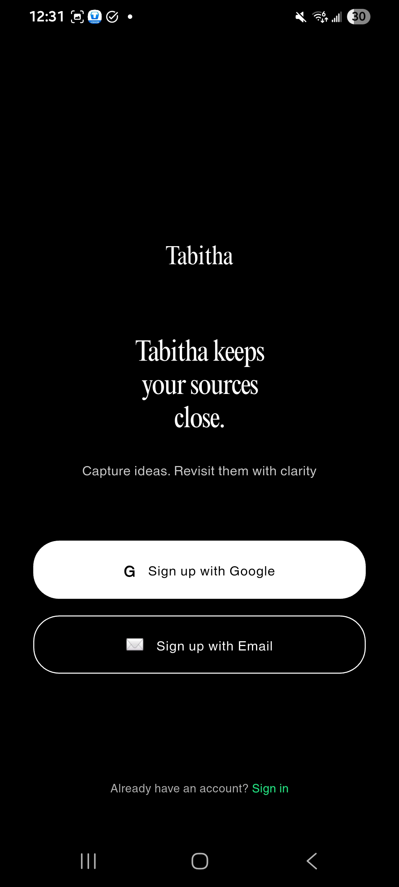

---

###  Sign Up & Login
- **Sign up screen (no text yet)**  
  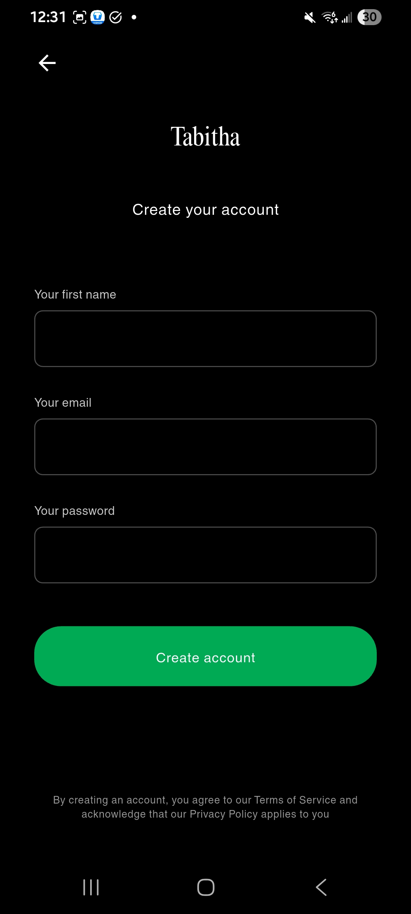

- **Full sign up screen**  
  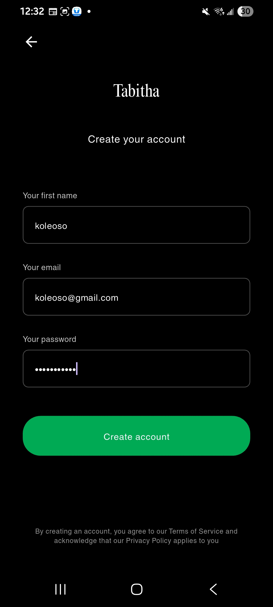

- **Account created successfully message**  
  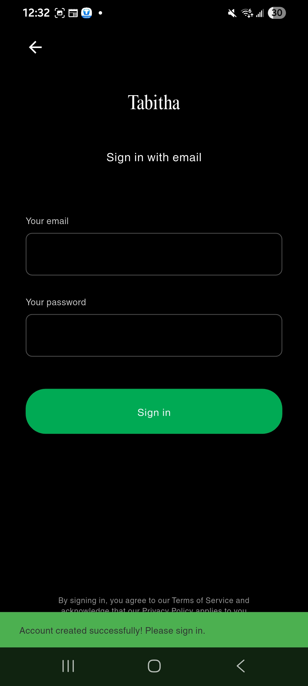

- **Login failed (needs improvement)**  
  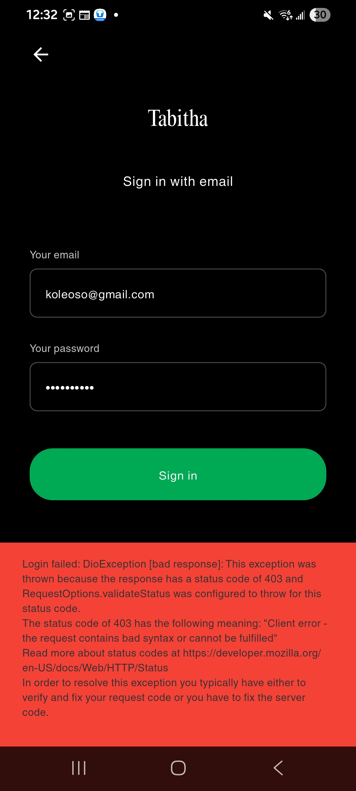

---

###  Home & Bookmarking
- **Home page**  
  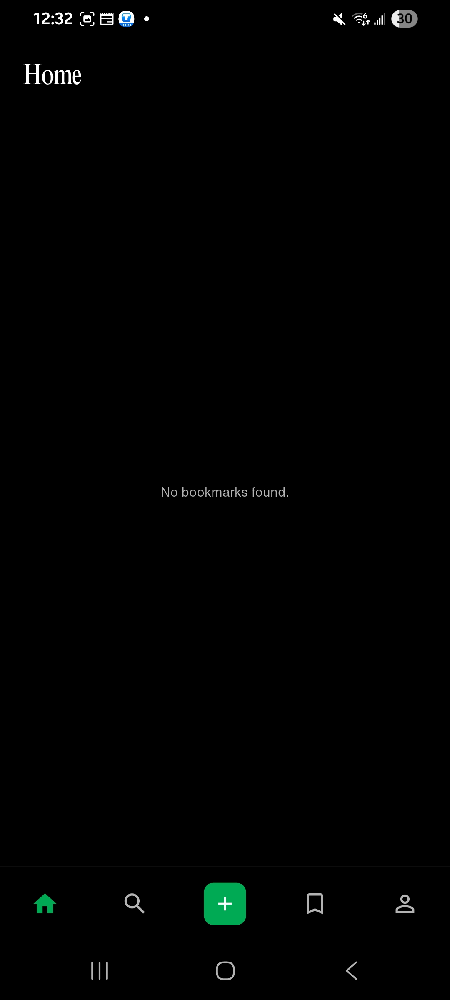

- **Create a new bookmark**  
  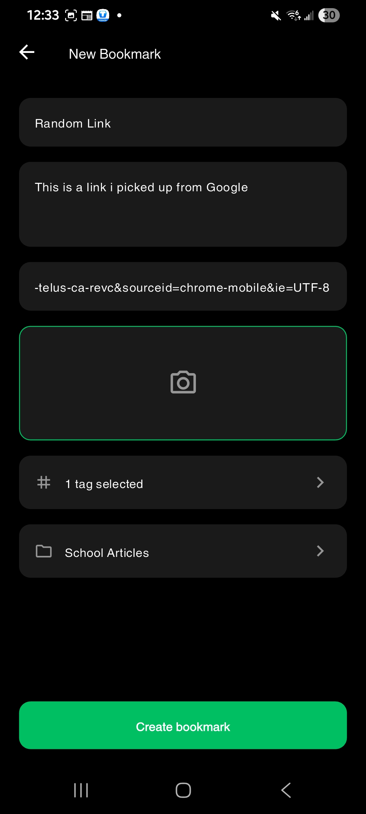

- **Image functionality (coming soon... maybe)**  
  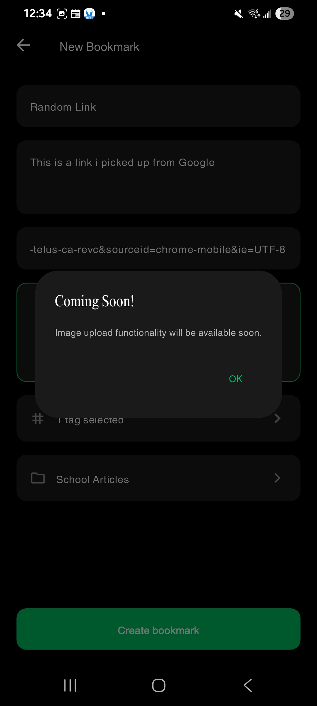

- **Bookmark created message**  
  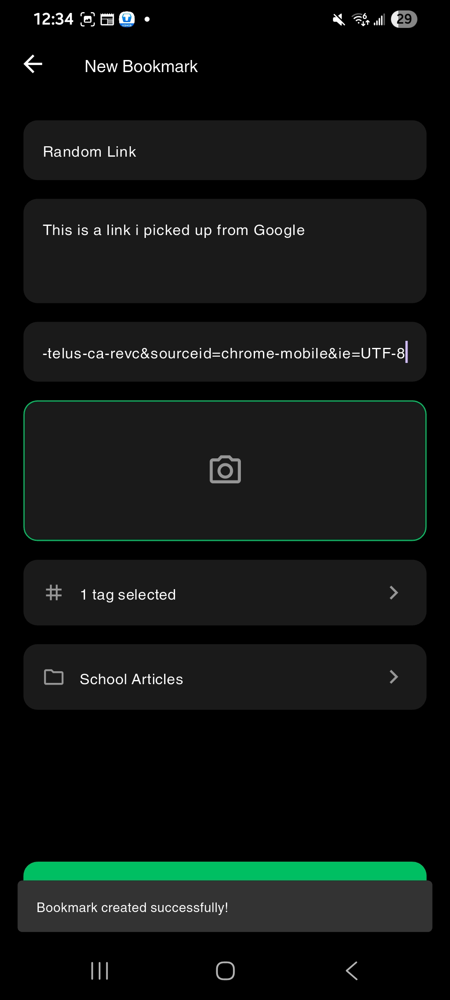

- **Bookmark already stored notice**  
  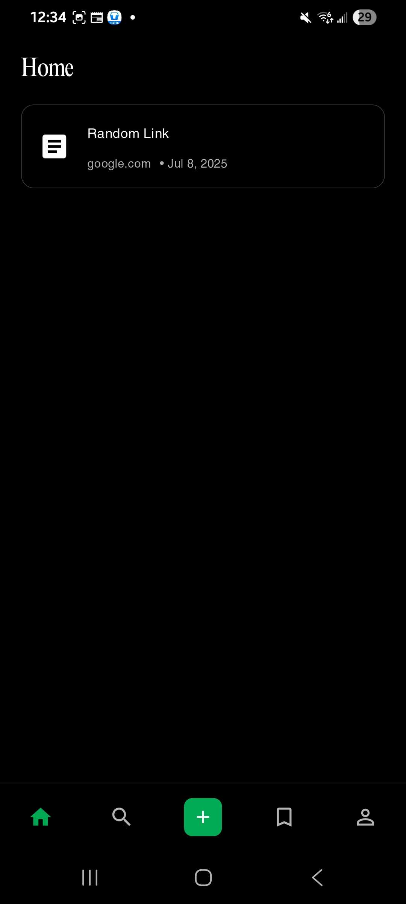

---

###  Tags, Folders, & Sharing
- **Choose a tag**  
  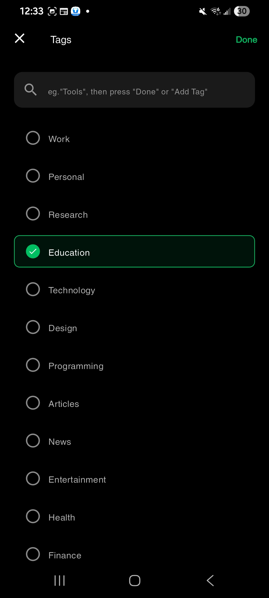

- **Choose a folder**  
  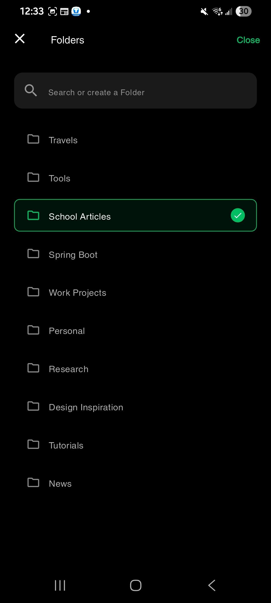

- **Share and copy functionality**  
  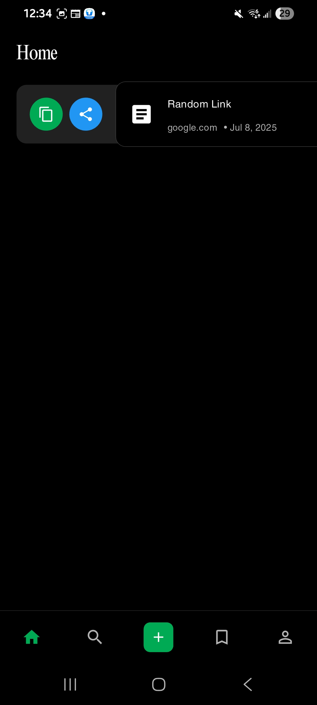

- **Delete and edit functions**  
  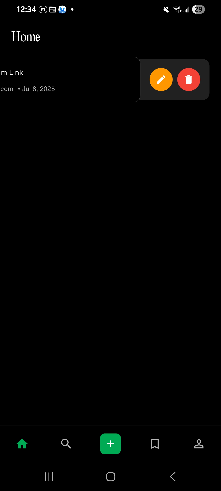

